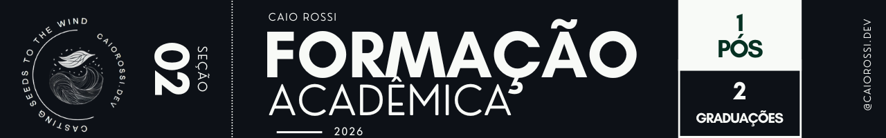
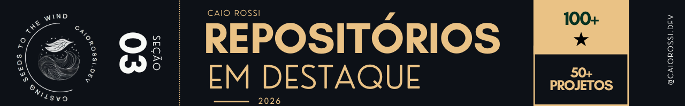

<h1>Read.me em construção</h1>
 

Sou desenvolvedor fullstack com foco em frontend, pós-graduado e com mais de três anos de estudo contínuo e experiência prática no desenvolvimento de aplicações web. Atuo na construção de interfaces de usuário e na implementação de funcionalidades no backend.

Atuo também como desenvolvedor freelancer sob a marca pessoal **caiorossi.dev**, onde venho estruturando e fortalecendo minha presença profissional por meio da produção de conteúdo e posicionamento da marca, principalmente através do Instagram.

Nesse contexto, atuo de forma multidisciplinar, assumindo diferentes responsabilidades ao longo do ciclo de desenvolvimento, incluindo concepção da ideia, design, desenvolvimento frontend e backend, além de atividades relacionadas à comunicação, vendas e marketing dos projetos.

---

### 🎓 Pós-graduação

**Desenvolvimento Fullstack** — (03/2025 – 02/2026)  
<a href="./assets/docs/Pós.png" target="_blank">🔗 Ver diploma</a>

  

### 🎓 Graduação

**Análise e Desenvolvimento de Sistemas** — (10/2024 – 06/2027)  
<a href="link-da-imagem-ads.jpg" target="_blank">🔗 Cursando</a>

 

**Tecnologia em Gestão de Turismo** — (2018 – 2021)  
<a href="link-da-imagem-turismo.jpg" target="_blank">🔗 Ver diploma</a>

---

- ⚛️ **React em Profundidade** — Plano de estudos avançado de React com foco em **filosofia da biblioteca, arquitetura de componentes, hooks, gerenciamento de estado, renderização e padrões modernos**. Repositório estruturado em módulos com **anotações, exemplos práticos e reflexões técnicas** para aprofundamento no ecossistema React.

- 📄 **Ajuda PEX Descomplica** — Guia criado para auxiliar alunos do curso de **Análise e Desenvolvimento de Sistemas** na execução do **Projeto de Extensão (PEX)**. Inclui um **PDF explicativo e o Gerador de PEX**, ferramenta que automatiza a criação do relatório utilizado por mais de **140 estudantes**.

---

- 📄 **Gerador de PEX** — Aplicação que permite a alunos preencher relatórios de projetos de extensão em um formulário interativo, visualizar o resultado em tempo real e baixar automaticamente um PDF pronto. Mais de **10.000 acessos singulares** e **180 usuários**.

- 💰 **CashMate** — Aplicativo que simplifica contagem de dinheiro, cálculo de troco e retirada de valores no fechamento do caixa utilizando um algoritmo guloso. Atualmente utilizado por **dois clientes ativos**.

- 📚 **Bookbay** — Plataforma de e-commerce fullstack para venda de livros usados com painel administrativo, roteamento e API própria em Node.js. Com a aplicação no ar, cerca de **30% do catálogo original foi vendido**.

- ⚖️ **Yara Justino** — Landing page responsiva desenvolvida para uma cliente e seu escritório de advocacia. Projeto com foco em **SEO e performance**, alcançando **nota 100 no Lighthouse**.

- ⚽ **Quem Joga?** — Aplicação para acompanhar ligas de futebol e jogos do dia, consumindo API externa em tempo real para exibir horários e logos das equipes.

- 🤖 **Lead Scraper & AI Qualification Engine** — Aplicação para geração automatizada de leads a partir de buscas no Google, com extração de perfis do Instagram e dados estruturados. Permite encontrar e qualificar **100+ perfis profissionais em menos de 5 minutos**, exportando dados em **JSON e CSV** e utilizando **IA local via Ollama** para classificar leads e gerar abordagens comerciais personalizadas.

---

- 🏆 **Hackathon Bemobi 2025** — Finalista, atuando na prototipagem e desenvolvimento de solução tecnológica em ambiente de alta colaboração e prazo curto.

## Certificações

🎓 <a href="./assets/docs/CS50x.pdf" target="_blank">
CS50x — Introduction to Computer Science (Harvard University)
</a>

🎓 <a href="./assets/docs/CS50T.pdf" target="_blank">
CS50t - Understanding Technology</a>

 

